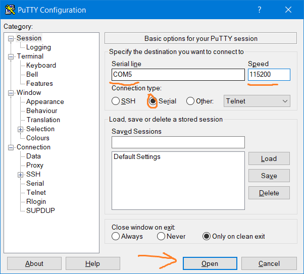
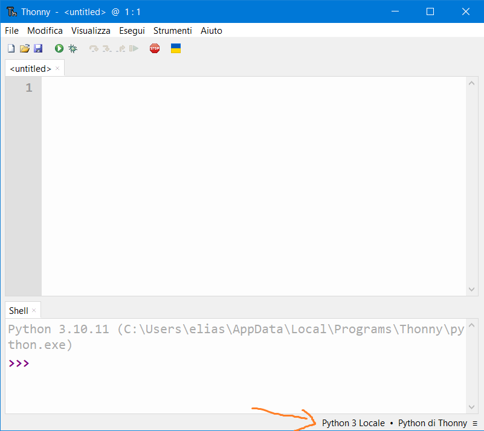
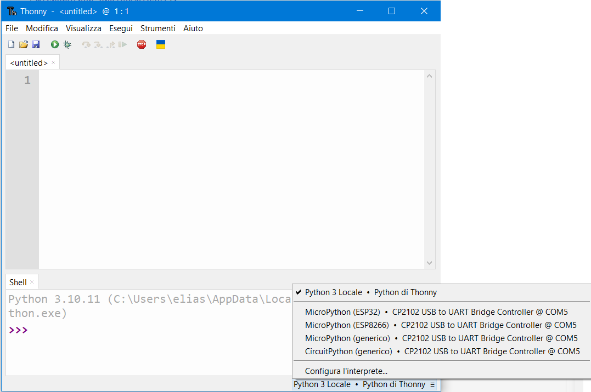
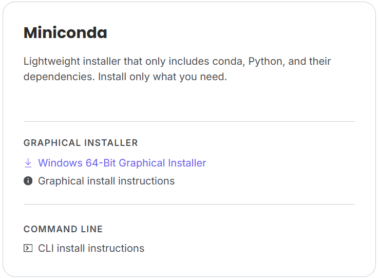

# Installazione
## FASE 1
Per effettuare una corretta configurazione del dispositivo esp32:

 - prima di iniziare "windows + x", "gestione dispositivi" e vedete se compare un errore per un dispositivo di cui non è installato il driver: in tal caso inserite quella dicitura sul motore di ricerca e scaricate il driver previsto.
 - per essere sicuri di aver effettuato l'installazione dei driver senza problemi, premere "windows + x" e selezionare la voce "Gestione dispositivi": se l'installazione è andata a buon fine allora si vedrà una voce dedicata sulla porta usata (ad esempio a me in corrispondenza della COM5 vedo "Silicon Labs CP210x USB to UART Bridge");
 <details>
  <summary>ulteriore conferma la si può ottenere con **Arduino IDE**, oppure con putty.</summary>

   
 <p>Dopo aver effettuato la connessione, provare a premere il tasto reset sulla board e vedere se sul terminale succede qualcosa;</p>
 </details>
 <details>
  <summary>in alternativa usare thonny</summary>

   
 <p>Digitando sulla parte indicata dalla freccia, si apre un menù a tendina che vi permette una serie di opzioni selezionabili per l'interprete.</p>

   
 </details>

```

 Attenzione:
 Se durante il tentativo di configurazione il dispositivo resta nascosto o non reperibile probabilmente si sta usando un cavo errato che non permette lo scambio di informazioni tra l'esp e il pc, ma solo il caricamento di una batteria.

```

## FASE 2

 - una volta installati i driver dobbiamo provvedere a sostiuire il firmware interno dell'esp dato che non è compatibile con micropython;
  - per fare ciò possiamo usare un ambiente virtuale realizzato con anaconda (o per chi volesse con il terminale di visual studio code);<br>

  Prima bisogna installare anaconda (può bastare la versione [miniconda](https://www.anaconda.com/download/success))

  <details>
   <summary> Miniconda immagine sito</summary>
  
  </details>

  Una volta effettuata l'installazione aprire il "Anaconda Prompt" e digitare i seguenti comandi:

  ```
    conda create -n pr_esp32 python
    conda activate pr_esp32
    conda install conda-forge::esptool
    esptool.py --port PORTNAME erase-flash
    // dove portname va sostituito con il nome della porta
    esptool.py --baud 460800 write_flash 0x1000 ESP32_BOARD_NAME-DATE-VERSION.bin
    // il file esp32_board ecc ecc. sarebbe il firmware che va scaricato dal sito
    // micropython.org/download/
  ```

## FASE 3

Molte volte da repl può risultare ostico configurare il dispositivo. Questo per diverse motivazioni:
 - se volessimo compiare istruzioni dal web le indentazioni sarebbero un ostacolo;
 - eventuali caratteri potrebbero sporcare il codice;
 - un istruzione potrebbe non dare il risultato voluto e noi non ce ne renderemo conto;
In molti di questi casi il repl tende a chiudere la connessione. 

Per ovviare a questo problema possiamo scrivere in un file .py le istruzioni da svolgere, copiarlo nella memoria ed eseguirlo 
direttamente nell'esp32:

```
 // file di configurazione del wi-fi
  mpremote connect portausata fs cp wifi_config.py :wifi_config.py
 // questo comando copia il file 
  mpremote connect portausata run wifi_config.py
 // questo lo esegue direttamente nel dispositivo
```

<details>
<summart>Per puro esempio condivido con voi il file condiviso:</summary>

```python
import network
import time

def connect_wifi(ssid, password, timeout=15):
    wlan = network.WLAN(network.STA_IF)

    if wlan.isconnected():
        print("Già connesso:", wlan.ifconfig())
        return wlan

    wlan.active(False)
    time.sleep(1)
    wlan.active(True)
    time.sleep(1)
    # queste quattro istruzioni apparentemente inutili servono a sospendere momentaneamente il tentativo di connessione
    # questo per dare il tempo all'interfaccia di completare le varie operazioni, per poi fare la connessione.

    print(f"Connessione a {ssid}...")
    wlan.connect(ssid, password)

    start = time.time()
    while not wlan.isconnected():
        if time.time() - start > timeout:
            print("Timeout: connessione fallita")
            return wlan
        time.sleep(0.5)
        print(".", end="")

    print("\nConnesso!")
    print("Config di rete:", wlan.ifconfig())
    return wlan

if __name__ == "__main__":
    SSID = "TUO_SSID"
    PASSWORD = "TUA_PASSWORD"
    connect_wifi(SSID, PASSWORD)
```

</details>
